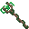
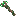
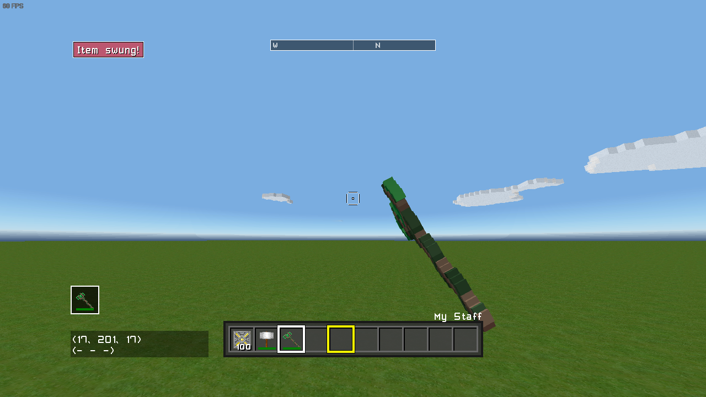
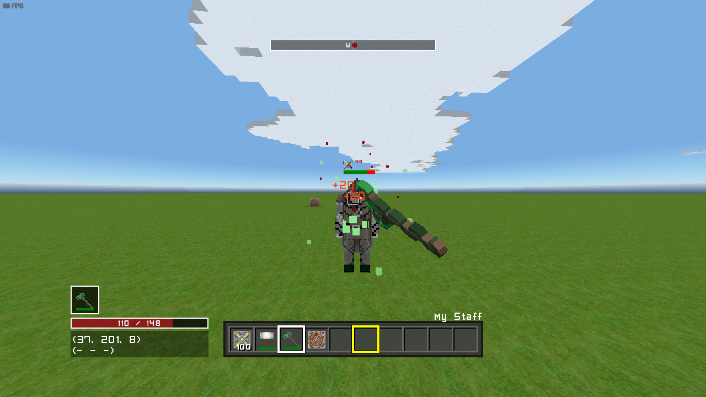

# Custom Items & C#

## Prerequisites:
- [Basic Setup](./README.md)

Custom items are added with XML, but you can use C# to add additional functionality, such as a swing event. However, accessing your custom items with C# isn't as simple as just using the ID. This guide will explain how to access your custom items with C#, and add swing events to them.

## Adding Custom Items

Custom items are added with XML. If your mod already has custom items, you can skip this section. I won't be going into too much detail about adding items here, just enough to get something working in-game.

Add an `ItemData.xml` file to your mod. This will contain an array of XML data for your items. Items have several XML files they can use. For more information, check the [XML Documentation](https://cmartin99.github.io/xml/items).

**NOTE:** Make sure you add these files to your mod folder in your game save location, not your project folder! They are only included in this project for ease of access/editing.

```xml
<?xml version="1.0" encoding="utf-8"?>
<ArrayOfModItemDataXML>
  <ModItemDataXML>
    <ItemID>MyStaff</ItemID>
    <Name>My Staff</Name>
    <Desc>An example staff item.</Desc>
    <MinCSPrice>1000</MinCSPrice>
    <StackSize>1</StackSize>
    <Durability>500</Durability>
    <Plural>S</Plural>
  </ModItemDataXML>
</ArrayOfModItemDataXML>
```

This defines your basic item data. Here we're defining a new item with the ID "MyStaff." We'll want 3 more XML files, though. Next is `ItemTypeData.xml`:

```xml
<?xml version="1.0" encoding="utf-8"?>
<ArrayOfModItemTypeDataXML>
  <ModItemTypeDataXML>
    <ItemID>MyStaff</ItemID>
    <Type>Weapon</Type>
    <ClassID>Wood</ClassID>
    <Inv>Weapon</Inv>
    <Model>WeaponTLBR</Model>
    <Swing>Weapon</Swing>
    <Equip>RightHand</Equip>
  </ModItemTypeDataXML>
</ArrayOfModItemTypeDataXML>
```

This defines where the item appears in the shop, its model, and other data relating to its type. Lastly, we'll need `ItemTextures32.xml` and `ItemTextures16.xml`. The content of these files will be exactly the same. This defines the texture the item will use from the mod's item texture atlas.

```xml
<?xml version="1.0" encoding="utf-8"?>
<ArrayOfItemXML>
  <ItemXML>
    <ItemID>MyStaff</ItemID>
  </ItemXML>
</ArrayOfItemXML>
```

We'll also need textures for our items. Total Miner supports 32x32 and 16x16 textures, depending on what texture pack the player is using. Those two `ItemTextures*.xml` files are for those different resolutions. The texture files themselves are named `TPI_32.png` and `TPI_16.png`. Make sure these textures are 16x16 and 32x32 respectively.

**NOTE:** You will need both of these. Failing to supply one or both may lead to crashes.

These are texture atlases, meaning all item textures from your mod will be included in a single image. They start in the top left, then from left -> right, top -> bottom. So for a 2x2 atlas, item 0 = top left, item 1 = top right, item 2 = bottom left, and item 3 = bottom right. This scales with the size of the atlas.

It is recommended to expand the atlas horizontally until you reach 32 items, (512 pixels for 16x, 1024 pixels for 32x), then expand vertically.

Because we only have one item right now, we can just use that item's texture. However, when we want to add more than one item, we'll have to add more items to the atlas.




## How do Item IDs work?

Total Miner uses numeric IDs for items. The first 256 items are blocks. You don't have to memorize these IDs, as you an access them through the `Item` enum:

```csharp
public sealed class TutorialPlugin : ITMPlugin
{
    public void PlayerJoined(ITMPlayer player)
    {
        // Adds a "SteelPickaxe" to the player's inventory when they
        // join the game.
        player.Inventory.AddToInventory(Item.SteelPickaxe);
    }
}
```

This works great for vanilla items, but your modded items won't be in this enum, because enums are defined at compile time. So to use your modded items with these methods, we'll have to do something slightly different.

You may have noticed that while your mod specified string IDs, the game still uses numeric IDs. This is because those string IDs are only used to easily identify items while developing the mod, but not actually used at all in-game. So how do you know the IDs for your items?

Your plugin's `Initialize` method is passed an `ITMPluginManager`, which contains type offsets. These type offsets are where your mod's content begins. The first item from your mod will be `offsets.ItemID`, the second item will be `offsets.ItemID + 1`, etc.

The index of your item will match the order in which it appears in `ItemData.xml`. Take the following `ItemData.xml`:

```xml
<?xml version="1.0" encoding="utf-8"?>
<ArrayOfModItemDataXML>
  <ModItemDataXML>
    <ItemID>MySword</ItemID>
    <!--Item Data here-->
  </ModItemDataXML>
  <ModItemDataXML>
    <ItemID>MyPickaxe</ItemID>
    <!--Item Data here-->
  </ModItemDataXML>
  <ModItemDataXML>
    <ItemID>MyBow</ItemID>
    <!--Item Data here-->
  </ModItemDataXML>
</ArrayOfModItemDataXML>
```

Relative to your mod's type offsets, `MySword` has the ID `0`, `MyPickaxe` has the ID `1`, and `MyBow` has the ID `2`, matching the order they appear in the XML.

## Accessing Custom Items with C#

**NOTE:** Don't hardcode your item IDs! (eg. `MyStaff = 597`). Even if this may seem to work, doing this means your mod will break with updates or if any other mods are added as the IDs shift.

To easily access these ID's we'll make a new static class. You can name this class whatever you want, but I would suggest `{ModName}Items`. This class will contain static properties/fields for your item IDs, and a method to initialize the IDs that takes `EnumTypeOffsets`.

```csharp
public static class TutorialItems
{
    public static Item MyStaff { get; private set; }

    public static void Initialize(EnumTypeOffsets offsets)
    {

    }
}
```

In the `Initialize` method, we'll set the properties. Unfortunately, without much more complicated and slower methods, this part has to be done manually. Set each property to `offsets.ItemID + {index}`, where `{index}` is the index of the item in your XML data. The resulting numeric ID can be casted to `Item` without worry.

```csharp
public static void Initialize(EnumTypeOffsets offsets)
{
    // the first item is offsets.ItemID + 0, so we don't have to add anything.
    MyStaff = (Item)offsets.ItemID;

    // For other items, set them to (Item)offsets.ItemID + index
    // eg. MySword = (Item)offsets.ItemID + 1;
}
```

Finally, don't forget to call this method in your plugin's `Initialize` method, otherwise we won't be able to use our items:

```csharp
public sealed class TutorialPlugin : ITMPlugin
{
    public void Initialize(ITMPluginManager mgr, ITMMod mod)
    {
        TutorialItems.Initialize(mgr.Offsets);
    }
}
```

Now we can use our custom items wherever we want! We can use the code from before but change `Item.SteelSword` to `TutorialItems.MyStaff` to add our custom item to the player's inventory.

```csharp
public sealed class TutorialPlugin : ITMPlugin
{
    public void PlayerJoined(ITMPlayer player)
    {
        // Adds our custom "MyStaff" item to the player's inventory
        // when they join the game.
        player.Inventory.AddToInventory(TutorialItems.MyStaff);
    }
}
```

## Adding Swing Events

We can add custom swing events with `ITMGame.AddEventItemSwing`. This method takes the ID of the item we want to add the event to, and an action for the event. The action is passed the item ID - which we won't need if our event is only used for one item - and the hand holding the item, which we can use to get the actor holding the item. We'll call this method in `InitializeGame`:

```csharp
public void InitializeGame(ITMGame game)
{
    _game = game;

    // This method takes an action. Methods can be implicitly cast
    // to delegates (an action is a delegate without a return value)
    // with the same parameters and return value.
    // MySwingEvent is method we're using for the event.
    game.AddEventItemSwing(TutorialItems.MyStaff, MySwingEvent);
}

// This is our swing event action.
private void MySwingEvent(Item item, ITMHand hand)
{
    _game.AddNotification("Item swung!");
}
```

To make sure everything's working, we'll display a notification.

**NOTE:** Hot reloading (F8) currently will not remove your custom swing events. This may result in crashes or strange behavior. For consistent behavior, I recommend reloading the world instead of hot reloading when dealing with item events.

If you did everything right, swinging your custom item should now display a notification:



You do anything you want in this event, but for this example we'll just make the staff damage the target and spawn some particles:

```csharp
private void MySwingEvent(Item item, ITMHand hand)
{
    if (hand.Owner is not ITMPlayer player)
    {
        // ActorInReticle is not available on ITMActor.
        // If you want the item to work for NPCs, you'll
        // have to implement the raycast logic yourself,
        // which is out of the scope of this tutorial.
        return;
    }

    ITMActor target = player.ActorInReticle;
    if (target == null)
    {
        // We return if the target is null, meaning
        // the player isn't targeting anything.
        return;
    }

    // We test the distance between the player and the target,
    // and return if it's greater than the specified distance.
    // This prevents us from damaging NPCs from across the map.
    float distance = 10;
    if (Vector3.Distance(player.Position, target.Position) > distance)
    {
        return;
    }

    // If all of those checks passed, we must have a valid target.
    // Now we can deal damage and spawn our particles.

    // To deal damage, we'll use the TakeDamageAndDisplay method,
    // passing the player as the attacker.
    target.TakeDamageAndDisplay(DamageType.Combat, 20, Vector3.Zero, player, TutorialItems.MyStaff, SkillType.Attack);

    // To spawn particles, we'll use the ITMWorld.AddParticle
    // method, and pass the position of the target + (0, 1, 0)

    // This is the data for the particles we want to spawn.
    ParticleData particle = new ParticleData()
    {
        Size = new Vector4(0.15f, 0.15f, 0.15f, 0),
        // Duration is measured in milliseconds, not seconds
        Duration = 1200,
        StartColor = Color.LightGreen,
        EndColor = Color.Transparent,
        VelocityVariance = new Vector3(5, 5, 5)
    };

    // We use a loop here to spawn multiple particles.
    for (int i = 0; i < 10; i++)
    {
        _game.World.AddParticle(target.Position + new Vector3(0, 1, 0), ref particle);
    }
}
```



You might notice that if you attack an enemy with this staff when they can't see you, they won't target you. This is because we're just dealing damage to them, not telling them that they're being attacked. To have them target the player when attacked, add this to the swing event immediately after `TakeDamageAndDisplay`:

```csharp
TargetingSystem.Target((IActorBehaviour)player, (IActorBehaviour)target);
```

This tells the NPC that the player is targeting the NPC that we dealt damage to. This causes the NPC we attack to target the player, as they will now recognize that they're being attacked. Note that we must cast both the NPC and the player to `IActorBehaviour` to call this method.

```csharp
private void MySwingEvent(Item item, ITMHand hand)
{
    // ...

    // To deal damage, we'll use the TakeDamageAndDisplay method,
    // passing the player as the attacker.
    target.TakeDamageAndDisplay(DamageType.Combat, 20, Vector3.Zero, player, TutorialItems.MyStaff, SkillType.Attack);

    // This ensures that the NPC will target the attacker, even if
    // they can't see them.
    TargetingSystem.Target((IActorBehaviour)player, (IActorBehaviour)target);

    // ...
}
```

These are the relevant changes we've made to get our custom item working:

`TutorialItems.cs`:
```csharp
using StudioForge.TotalMiner.API;
using StudioForge.TotalMiner;

namespace TMModTutorial
{
    public static class TutorialItems
    {
        public static Item MyStaff { get; private set; }

        public static void Initialize(EnumTypeOffsets offsets)
        {
            // the first item is offsets.ItemID + 0, so we don't have to add anything.
            MyStaff = (Item)offsets.ItemID;

            // For other items, set them to (Item)offsets.ItemID + index
            // eg. MySword = (Item)offsets.ItemID + 1;
        }
    }
}
```

`TutorialPlugin.cs`:

```csharp
using Microsoft.Xna.Framework;
using Microsoft.Xna.Framework.Graphics;
using StudioForge.BlockWorld;
using StudioForge.TotalMiner;
using StudioForge.TotalMiner.API;
using StudioForge.TotalMiner.Graphics;
using System;

namespace TMModTutorial
{
    public sealed class TutorialPlugin : ITMPlugin
    {
        private ITMGame _game;

        public void Initialize(ITMPluginManager mgr, ITMMod mod)
        {
            // Called once, when the mod is loaded.
            // Load any assets your mods needs (eg. textures) here.

            TutorialItems.Initialize(mgr.Offsets);
        }

        public void InitializeGame(ITMGame game)
        {
            // Called once after all mods are initialized.
            // Add events to the game here (eg. item swing events)
            // and set a game field to use later.

            _game = game;

            // This method takes an action. Methods can be implicitly cast
            // to delegates (an action is a delegate without a return value)
            // with the same parameters and return value.
            // MySwingEvent is method we're using for the event.
            game.AddEventItemSwing(TutorialItems.MyStaff, MySwingEvent);
        }

        private void MySwingEvent(Item item, ITMHand hand)
        {
            if (hand.Owner is not ITMPlayer player)
            {
                // ActorInReticle is not available on ITMActor.
                // If you want the item to work for NPCs, you'll
                // have to implement the raycast logic yourself,
                // which is out of the scope of this tutorial.
                return;
            }

            ITMActor target = player.ActorInReticle;
            if (target == null)
            {
                // We return if the target is null, meaning
                // the player isn't targeting anything.
                return;
            }

            // We test the distance between the player and the target,
            // and return if it's greater than the specified distance.
            // This prevents us from damaging NPCs from across the map.
            float distance = 10;
            if (Vector3.Distance(player.Position, target.Position) > distance)
            {
                return;
            }

            // If all of those checks passed, we must have a valid target.
            // Now we can deal damage and spawn our particles.

            // To deal damage, we'll use the TakeDamageAndDisplay method,
            // passing the player as the attacker.
            target.TakeDamageAndDisplay(DamageType.Combat, 20, Vector3.Zero, player, TutorialItems.MyStaff, SkillType.Attack);

            // This ensures that the NPC will target the attacker, even if
            // they can't see them.
            TargetingSystem.Target((IActorBehaviour)player, (IActorBehaviour)target);

            // To spawn particles, we'll use the ITMWorld.AddParticle
            // method, and pass the position of the target + (0, 1, 0)

            // This is the data for the particles we want to spawn.
            ParticleData particle = new ParticleData()
            {
                Size = new Vector4(0.15f, 0.15f, 0.15f, 0),
                // Duration is measured in milliseconds, not seconds
                Duration = 1200,
                StartColor = Color.LightGreen,
                EndColor = Color.Transparent,
                VelocityVariance = new Vector3(5, 5, 5)
            };

            // We use a loop here to spawn multiple particles.
            for (int i = 0; i < 10; i++)
            {
                _game.World.AddParticle(target.Position + new Vector3(0, 1, 0), ref particle);
            }
        }
    }
}
```