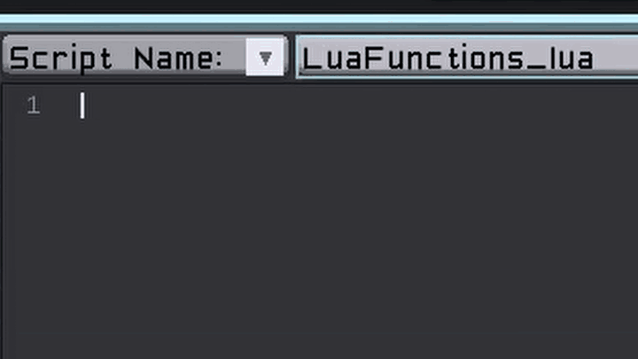

# Lua Functions

## Prerequisites:
- [Basic Setup](./BasicSetup.md)

Mods can add custom Lua functions that can be used by scripts. There is currently no way to add TMScript commands, so outside of `Callback`, this is the only way for scripts to communicate with mods.

## LuaFuncRegister

Rather than using the C API, Total Miner mods use NLua and a basic helper attribute named `LuaFuncRegister`. First, create a new class to hold your Lua functions. I'd recommend naming it `{ModName}Lua`. We'll name this class `TutorialLua`. This class will contain a constructor that takes an `ITMGame` instance, and an `ITMScriptInstance` instance. It's standard practice to name this script instance `si`. The script instance contains the actor the script is running on along with other useful properties.

One instance of this class will be created for each script instance. The game may create more than one script instance.

```csharp
using StudioForge.TotalMiner.API;

namespace TMModTutorial
{
    internal sealed class TutorialLua
    {
        private ITMGame _game;
        // The script instance contains the actor currently running the script,
        // along with some other useful properties.
        private ITMScriptInstance _si;

        public TutorialLua(ITMGame game, ITMScriptInstance si)
        {
            _game = game;
            _si = si;
        }
    }
}
```

Any methods in this class with the `LuaFuncRegister` attribute will be added as Lua Functions for scripts to use. Let's add a basic function that sets the player's fly mode:

```csharp
[LuaFuncRegister]
public void set_fly_mode(string fly_mode)
{
    // We want to return if the player can't fly to prevent abusing
    // this function.

    // _si.Player will be null if this script runs on an NPC.
    if (_si.Player == null)
    {
        return;
    }

    if (!_si.Player.HasPermission(Permissions.Fly))
    {
        return;
    }

    if (_game.World.GameMode != GameMode.Creative && !_si.Player.IsItemEquippedAndUsable(Item.AmuletOfFlight))
    {
        return;
    }

    // Convert the string fly mode passed by the script to the
    // FlyMode enum. If the script passes an unsupported fly mode,
    // we'll default to FlyMode.None.
    FlyMode flyMode = fly_mode switch
    {
        "none" => FlyMode.None,
        "slow" => FlyMode.Slow,
        "fast" => FlyMode.Fast,
        "custom" => FlyMode.Custom,
        _ => FlyMode.None
    };

    _si.Player.FlyMode = flyMode;
}
```

**NOTE:** Lua functions should use snake\_case naming, as that's what Lua usually uses.

This method is attributed with the `LuaFuncRegister` attribute, which will cause it to be automatically added as a callable function for Lua scripts. Use the parameterless constructor for the attribute, the parameters aren't currently used for modded functions.

Script functions may use most numeric types (eg. `int`, `long`, `float`, `double`), `string`, `LuaTable`, and `object` as parameters. `nil` is `null` in C#. Lua functions support params arrays. eg. the function `custom_function(params object[] args)` may be called from a Lua script via `custom_function(arg1, arg2, arg3)`

## Providing Your Functions

Just creating the class isn't enough to actually use your functions. In your plugin, the `RegisterLuaFunctions` method must return an array containing an instance of your Lua functions object. The array can contain multiple objects, but generally you should only need one.

```csharp
public object[] RegisterLuaFunctions(ITMScriptInstance si)
{
    // Called when registering Lua functions to a script instance.
    // Return an array containing an instance of your Lua functions
    // class or an empty array (if you don't add any Lua functions) here.
    return new object[] { new TutorialLua(_game, si) };
}
```

And that's it, you're done! Now scripts can use your custom Lua functions. Your functions will automatically appear in the script auto completion.

**NOTE:** You cannot currently hot-reload Lua functions. You *must* reload the world to reload your Lua functions.




## Full Code

You can find the code for this stage of the project [here](https://github.com/DaveTheMonitor/TMModTutorial/tree/master/LuaFunctions). Feel free to cross-check your project with this one to ensure you didn't miss anything.

NOTE: If you clone the project, it will not build! This is because the GitHub repository does not include the referenced assemblies, as they contain Total Miner's code and cannot be redistributed. To make the project build, follow the ["Creating the Mod Project" steps 3-4](./BasicSetup.md#creating-the-mod-project) after cloning the project. The added assemblies should automatically be referenced, allowing you to build the project without errors.