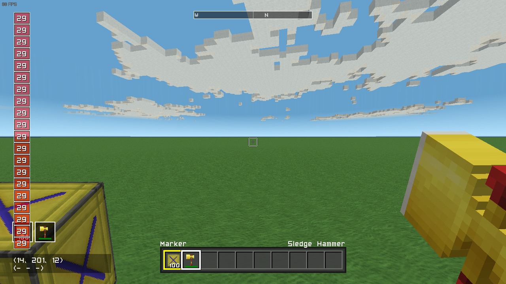
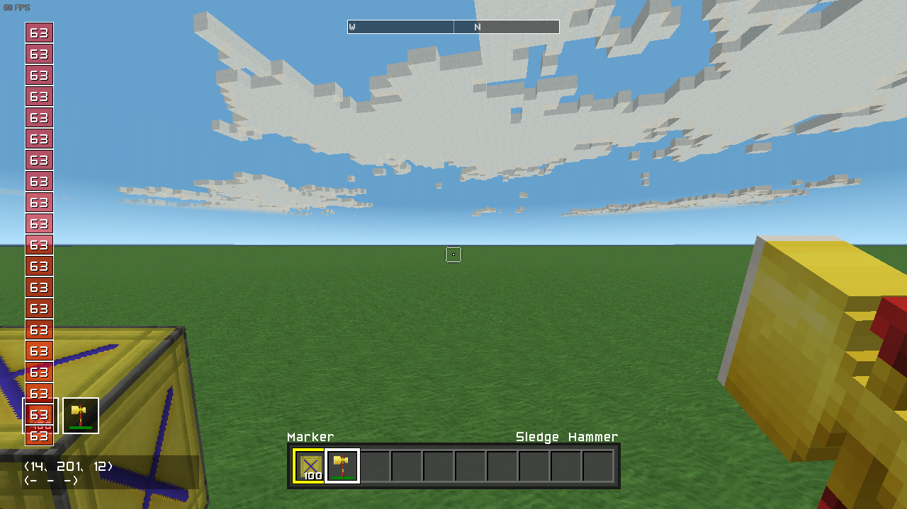
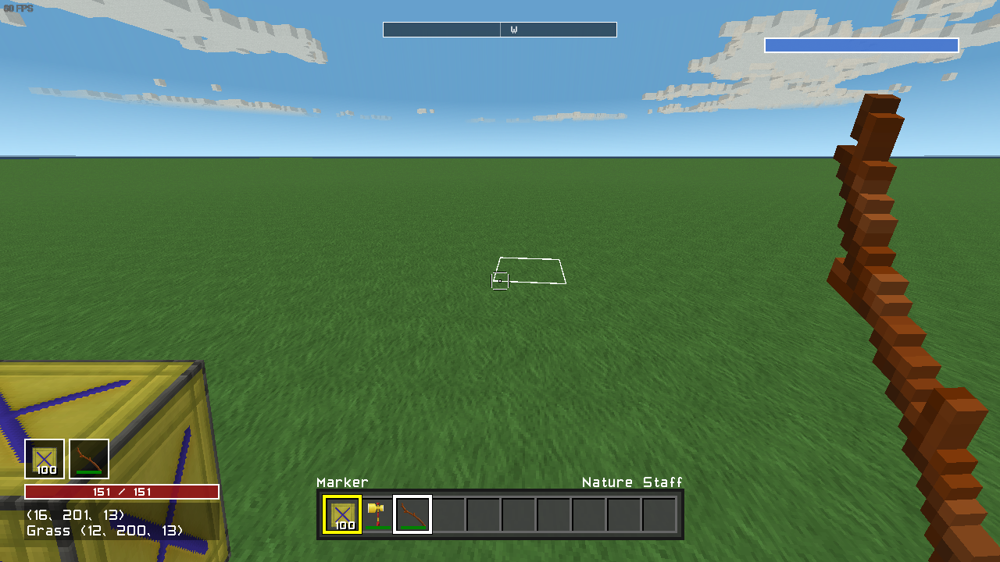
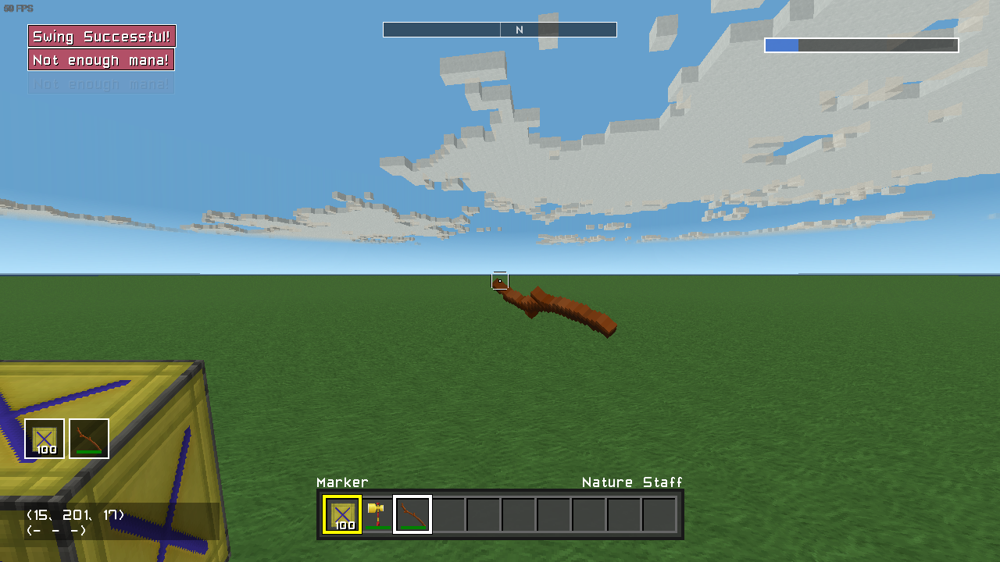

# Custom Player Data

## Prerequisites:
- [Basic Setup](./README.md)
- [Saving Data](./SavingData.md)

You may want to give players some custom data for your mod. For example, your mod may add magic weapons that use mana. Unfortunately, the vanilla API doesn't support this. Instead, we'll have to build our own system.

## Identifying Players

Although mods aren't supported in multiplayer yet, we still want to account for it so we don't have to change much for it to work. Because of this, we need a way to identify different players in the game. We can do this using `ITMPlayer.GamerID`. The `GamerID` contains a unique, unchanging ulong for the player's ID. We can use this to identify a player even if we don't have the `ITMPlayer` object, which we'll need later.

Here's how our system will work:

We'll use a dictionary where the key is a `ulong`, and the value is a custom class that will store our data. A dictionary is an object that allows us to access a value by some key. This key can be anything, but it is most often something like a string. For our use, we'll use the player's `ulong` ID as the key. When we need to access the player's data, we'll look it up in this dictionary.

## Adding Custom Data

To get started, we'll add two new classes: `TutorialPlayerData`, and `TutorialPlayerDataManager`. `TutorialPlayerData` will store our custom data for a player, and `TutorialPlayerDataManager` will simplify using the data.

`TutorialPlayerData.cs`:

```csharp
using StudioForge.TotalMiner.API;

namespace TMModTutorial
{
    public sealed class TutorialPlayerData
    {
        public ITMPlayer Player { get; private set; }
        private ITMGame _game;

        public TutorialPlayerData(ITMGame game, ITMPlayer player)
        {
            Player = player;
            _game = game;
        }
    }
}
```

`TutorialPlayerDataManager.cs`:

```csharp
using StudioForge.TotalMiner.API;
using System;

namespace TMModTutorial
{
    public sealed class TutorialPlayerDataManager
    {
        public TutorialPlayerData GetData(ITMPlayer player)
        {
            throw new NotImplementedException();
        }
    }
}
```

Feel free to rename these to something like `{ModName}PlayerData` and `{ModName}PlayerDataManager`.

To start with, we'll give all players some default data. Later, we'll implement saving and loading this data.

Let's add the dictionary that will store our data to `TutorialPlayerDataManager`:

```csharp
using StudioForge.TotalMiner.API;
using System;
using System.Collections.Generic;

namespace TMModTutorial
{
    public sealed class TutorialPlayerDataManager
    {
        private Dictionary<ulong, TutorialPlayerData> _data;
        private ITMGame _game;

        public TutorialPlayerData GetData(ITMPlayer player)
        {
            throw new NotImplementedException();
        }

        public TutorialPlayerDataManager(ITMGame game)
        {
            _data = new Dictionary<ulong, TutorialPlayerData>();
            _game = game;
        }
    }
}
```

Since we aren't implementing saving/loading yet, we'll initialize the data when `GetData` is called for the first time. This is called "lazy initialization."

We can do this by using `Dictionary<TKey, TValue>.TryGetValue`. If `TryGetValue` returns false, then the data doesn't exist, so we'll create new data. But if it returns true, then the data does exist and we'll return that.

```csharp
public TutorialPlayerData GetData(ITMPlayer player)
{
    // We check if the player has data already, and if they do,
    // return that. If they don't, we create new data for them.
    if (_data.TryGetValue(player.GamerID.ID, out TutorialPlayerData data))
    {
        return data;
    }

    data = new TutorialPlayerData(player);
    _data.Add(player.GamerID.ID, data);
    return data;
}
```

To make sure it's working, we'll add a number to the player data that's set to a random number between 0-100 when the data is created.

```csharp
public sealed class TutorialPlayerData
{
    public float Num { get; private set; }

    public TutorialPlayerData(ITMGame game, ITMPlayer player)
    {
        // ...

        Num = game.Random.Next(0, 100);
    }
}
```

To use our custom data, we'll create a new `TutorialPlayerDataManager` in `ITMPlugin.InitializeGame` and use `GetData` whenever we need our custom data.

```csharp
public sealed class TutorialPlugin : ITMPlugin
{
    public TutorialPlayerDataManager PlayerData { get; private set; }

    public void InitializeGame(ITMGame game)
    {
        PlayerData = new TutorialPlayerDataManager(game);
    }
}
```

Now we'll add a notification that displays this number every frame in `ITMPlugin.Update(ITMPlayer)`. It sholud be a different number on each hot reload.

```csharp
public void Update(ITMPlayer player)
{
    // Called for each player every frame.
    // Implement any player-dependent logic that needs to run every
    // frame here.
    _game.AddNotification(PlayerData.GetData(player).Num.ToString());
}
```




Now, we'll add a `RemoveData` method that removes our player data. We'll call this method from `ITMPlugin.PlayerLeft`

`TutorialPlayerDataManager.cs`:

```csharp
public sealed class TutorialPlayerDataManager
{
    internal void RemoveData(ITMPlayer player)
    {
        _data.Remove(player.GamerID.ID);
    }
}
```

`TutorialPlugin.cs`:

```csharp
public sealed class TutorialPlugin : ITMPlugin
{
    public void PlayerLeft(ITMPlayer player)
    {
        // Called when a player leaves the game.
        PlayerData.RemovePlayerData(player);
    }
}
```

**NOTE:** `RemoveData` is internal because other mods that might reference ours shouldn't be able to call it.

Now when a player leaves the game, their data will be deleted.

Finally, we'll change our data so instead of being lazy initialized, it's added when the player joins. We'll add an `AddData` method to our `TutorialPlayerDataManager` that initializes the player's data:

```csharp
public sealed class TutorialPlayerDataManager
{
    public TutorialPlayerData GetData(ITMPlayer player)
    {
        return _data[player.GamerID.ID];
    }

    internal void AddData(ITMPlayer player)
    {
        TutorialPlayerData data = new TutorialPlayerData(_game, player);
        _data.Add(player.GamerID.ID, data);
    }
}
```

We'll call this method from two places: `ITMPlugin.PlayerJoined`, and `ITMPlugin.InitializeGame`. The reason we need to call it from both is because if we hot reload the mod, `PlayerJoined` won't be called for anyone currently in the game (including the local player), but the first time we load the mod, no players will be in the world. So by adding the data in both, we handle both the first load, and future hot reloads.

```csharp
public sealed class TutorialPlugin : ITMPlugin
{
    public void InitializeGame(ITMGame game)
    {
        PlayerData = new TutorialPlayerDataManager(game);

        // We initialize player data here so data exists for players
        // after a hot reload, as PlayerJoined isn't called for existing
        // players on  a hot reload. Without this, hot reloading the mod
        // will cause a crash.
        List<ITMPlayer> players = new List<ITMPlayer>();
        game.GetAllPlayers(players);
        foreach (ITMPlayer player in players)
        {
            PlayerData.AddData(player);
        }
    }

    public void PlayerJoined(ITMPlayer player)
    {
        // Called when a player joins the game.
        PlayerData.AddData(player);
    }
}
```

## Adding Mana

Now that our data is working, we'll give the player some mana that is used when swinging the Nature Staff. If you have a custom staff item like the [CustomItems](./CustomItems.md) tutorial, consider using this mana for that item instead!

For this example, the player will have 100 max mana and use 25 per swing, regenerating 5 mana per second. Swinging the item will display a notification telling whether or not the player has the mana to use it.

First, we'll replace our random number with Mana, and set it to 100 by default. We'll also add an `Update` method that regenerates `5 / Services.ElapsedTime` mana every frame, up to 100.

```csharp
using StudioForge.Engine;

public sealed class TutorialPlayerData
{
    public float Mana { get; set; }

    public void Update()
    {
        // Services.ElapsedTime is Total Miner's version of DeltaTime.
        // Multiplying 5 by this value gives us the number required to
        // regenerate 5 mana per second.
        Mana += 5 * Services.ElapsedTime;

        // Clamp - that is, limit - the number between 0 and 100. If the
        // mana is below 0, it will be set to 0, and it it's above 100,
        // it will be set to 100.
        Mana = Math.Clamp(Mana, 0, 100);
    }

    public TutorialPlayerData(ITMGame game, ITMPlayer player)
    {
        Mana = 100;
    }
}
```

We'll call `TutorialPlayerData.Update` in `Update(ITMPlayer)`:

```csharp
public void Update(ITMPlayer player)
{
    PlayerData.GetData(player).Update();
}
```

Next we'll add a bar that displays our current mana so we can see how much we have left. How this works isn't the focus of this tutorial - feel free to just copy/paste it for testing. All that matters is that it'll be empty when we have 0 mana, and full when we have 100 mana. I'll add a tutorial dedicated to drawing UI in the future, so how this works will be explained in more detail there. We draw this bar in `ITMPlugin.Draw`

```csharp
public void Draw(ITMPlayer player, ITMPlayer virtualPlayer, Viewport vp)
{
    // Called every rendered frame.
    // Draw custom UI or geometry here.

    // CCTV will use GamerID.Sys1, so we only draw the mana
    // is the ID isn't Sys1 (in other words, only if we're
    // drawing a real player's HUD)
    if (virtualPlayer.GamerID != GamerID.Sys1)
    {
        DrawMana(player, virtualPlayer, vp);
    }
}

private void DrawMana(ITMPlayer player, ITMPlayer virtualPlayer, Viewport vp)
{
    int x = CoreGlobals.GraphicsDevice.Viewport.Width - 300;
    int y = 50;
    int width = 246;
    int height = 16;
    float mana = PlayerData.GetData(virtualPlayer).Mana;
    SpriteBatchSafe spriteBatch = CoreGlobals.SpriteBatch;

    spriteBatch.Begin();
    DrawBar(spriteBatch, x, y, width, height, mana, 0, 100, Color.White, Color.Black * 0.5f, new Color(71, 129, 235) * 0.8f);
    spriteBatch.End();
}

private void DrawBar(SpriteBatchSafe spriteBatch, int x, int y, int width, int height, float current, float min, float max, Color outline, Color back, Color fill)
{
    float progress = (current - min) / (max - min);

    spriteBatch.DrawFilledBox(new Rectangle(x - 2, y - 2, width + 4, height + 4), 2, outline, back);
    spriteBatch.DrawFilledBox(new Rectangle(x, y, (int)(width * progress), height), 0, fill, fill);
}
```

We now have a mana bar in the top right that displays our current mana.



Next we'll add the swing functionality. This will be a simple swing event. For more information on swing events, see [Custom Items](./CustomItems.md)

```csharp
public void InitializeGame(ITMGame game)
{
    game.AddEventItemSwing(Item.NatureStaff, StaffSwing);
}

private void StaffSwing(Item item, ITMHand hand)
{
    // We only want this swing event to execute for players, so we
    // return early if the actor is not a player.
    if (hand.Owner is not ITMPlayer player)
    {
        return;
    }

    // This item will use 25 mana. If we don't have 25 mana, it
    // won't do anything. If we do have 25 mana, it'll use 25
    // mana.
    TutorialPlayerData data = PlayerData.GetData(player);
    if (data.Mana >= 25)
    {
        data.Mana -= 25;
        _game.AddNotification("Swing Successful!");
    }
    else
    {
        _game.AddNotification("Not enough mana!");
    }

    // Because our data is a reference type, we don't have to set
    // the data after changing it. We can get the data, change what
    // we want, and it'll change on the player.
}
```

Now when we swing the staff, it will use 25 mana, and display a notification displaying whether the swing was successful.



## Saving Our Data

Now that we have our custom data for the player, we need to save it so it doesn't reset when we exit the world. Saving data for players is somewhat complicated, so we'll go through it step by step. If you haven't already, be sure to take a look at the [Saving Data](./SavingData.md) tutorial, since knowing how to save data is required for this part.

There's a few things we need to keep in mind when reading and writing data:
- The player will not be in the game when `InitializeGame` is called.
- We need to save and preserve data for players who aren't in the game.

Although multiplayer isn't supported for mods yet, we still want to design our system for it. So here's how we'll handle player data:

We'll create a new struct that contains our player save data. We'll read this when we load the world, and convert it to the full player data when a player joins. When a player leaves, we'll convert their data back to this struct and save it when the world is saved.

There's some ways we could save data that would allow us to not store the data for players not in the game at all, but those are more complicated to do well. This simple system should be good enough for most cases.

You might think we could just read the data and add the player to the data dictionary. While that would work, the reason we create a new struct instead of just adding the player to our data dictionary is for memory and performance.

Generally speaking, we save a lot less data than we have at runtime. For example, the player may have a maximum mana that can be changed, but we don't need to save it because we can calculate it based on equipped items. Or maybe the player can be given a temporary effect that only lasts a few seconds (like the ice effect in vanilla, or a cooldown for an item). Saving the duration of an effect that only lasts a few seconds would be pointless, so we don't save it.

So, let's add a struct that contains a player ID (`ulong`) and their current mana:

```csharp
namespace TMModTutorial
{
    internal struct TutorialPlayerSaveData
    {
        public ulong ID;
        public float Mana;
    }
}
```

**NOTE:** We make this struct internal because other mods that might reference our DLL shouldn't be able to use it.

Now we'll add some methods to create this struct from a `TutorialPlayerData` and create a `TutorialPlayerData` from this struct. We'll put these methods on `TutorialPlayerData` so we have access to private fields we might need to save (though we don't currently have any).

```csharp
public sealed class TutorialPlayerData
{
    internal TutorialPlayerSaveData ToSaveData()
    {
        TutorialPlayerSaveData saveData = new TutorialPlayerSaveData()
        {
            ID = Player.GamerID.ID,
            Mana = Mana
        };

        return saveData;
    }

    internal static TutorialPlayerData FromSaveData(ITMGame game, ITMPlayer player, TutorialPlayerSaveData saveData)
    {
        TutorialPlayerData data = new TutorialPlayerData(game, player)
        {
            Mana = saveData.Mana
        };

        return data;
    }
}
```

**NOTE:** These methods must be internal because our save data struct is internal!

**NOTE:** `FromSaveData` is static so we can use it without needed a `TutorialPlayerData` reference.

Next we'll add a list to `TutorialPlayerDataManager` that will store our save data. This list will be empty initially, but entries will be added when the game saves or when players leave the game.

```csharp
public sealed class TutorialPlayerDataManager
{
    private List<TutorialPlayerSaveData> _saveData;

    public TutorialPlayerDataManager(ITMGame game)
    {
        // This list will store the save state for players. It is
        // empty initially but will have data added to it when
        // the world is loaded, saved, or players leave the game.
        _saveData = new List<TutorialPlayerSaveData>();
    }
}
```

Now, we'll change our `RemoveData` method to overwrite the player's save data, or add it if it doesn't exist:

```csharp
public sealed class TutorialPlayerDataManager
{
    internal void RemoveData(ITMPlayer player)
    {
        // This overload of Remove sets the out paramater to the
        // item that was removed.
        _data.Remove(player.GamerID.ID, out TutorialPlayerData data);
        UpdateSaveData(data);
    }

    private void UpdateSaveData(TutorialPlayerData data)
    {
        ulong id = data.Player.GamerID.ID;

        // We loop through the save data to find an existing data
        // for this player. If we find it, we overwrite it. If we
        // don't, we add it.
        for (int i = 0; i < _saveData.Count; i++)
        {
            // If the IDs don't match, this isn't the same player,
            // so we continue the loop.
            if (_saveData[i].ID != id)
            {
                continue;
            }

            // This will only be executed is the ID for the save
            // data and the player match. We overwrite the data
            // and immediately exit the method here.
            _saveData[i] = data.ToSaveData();
            return;
        }

        // This will only be executed if no data for the player
        // was found. Here we'll add new save data for the player.
        _saveData.Add(data.ToSaveData());
    }
}
```

Next, we'll implement the saving for our data. Here's how we'll format our data:
```
Player Data Count : int32
for each Player Data:
  - ID : uint64
  - Mana : single
```

Let's add a `WriteState` method to `TutorialPlayerDataManager` that takes a `BinaryWriter` and writes the current save state to it:

```csharp
public sealed class TutorialPlayerDataManager
{
    internal void WriteState(BinaryWriter writer)
    {
        // We update our save data before writing it so we don't
        // write outdated data or miss any players.
        foreach (TutorialPlayerData data in _data.Values)
        {
            UpdateSaveData(data);
        }

        // Now we write the data to the BinaryWriter

        // Player Data Format:
        // Player Data Count : int32
        // for each Player Data:
        //   - ID : uint64
        //   - Mana : single

        writer.Write(_saveData.Count);
        foreach (TutorialPlayerSaveData saveData in _saveData)
        {
            writer.Write(saveData.ID);
            writer.Write(saveData.Mana);
        }
    }
}
```

Now we'll call this method in `ITMPlugin.WorldSaved`:

```csharp
public sealed class TutorialPlugin : ITMPlugin
{
    public void WorldSaved(int version)
    {
        // Called when the world is saved.
        // Use ITMGame.World.WorldPath to get the world path if you
        // want to save files.

        // Opens or creates a new file named `tutorialdata.dat` in the
        // world folder to write data to.
        string file = Path.Combine(_game.World.WorldPath, "tutorialdata.dat");
        using FileStream stream = FileSystem.OpenWrite(file);

        // Creates a new BinaryWriter that writes to the stream we opened.
        using BinaryWriter writer = new BinaryWriter(stream);

        // Globals1.SaveVersion is the current save version for TM.
        writer.Write(Globals1.SaveVersion);

        // Here we'll write the current save version for our mod.
        // We'll want to increment this whenever we make changes to
        // our save format.
        writer.Write(0);

        // We want to write our save data here.
        PlayerData.WriteState(writer);

        // The file is saved when the writer is disposed, which
        // happens when this method ends because of the using statements.
        // So there is no need to manually save the file.
    }
}
```

Now when we save the game, our `tutorialdata.dat` will contain the player's current mana. That file should now look like this:
```
TM Version : int32
Mod Version : int32
Player Data Count : int32
for each Player Data:
  - ID : uint64
  - Mana : single
```

This comes out to 24 bytes for a single player.

However, if we hot reload our mana still resets. This is because we aren't actually reading this data. Let's add a `ReadState` method to the `TutorialPlayerDataManager` that reads the save data.

```csharp
public sealed class TutorialPlayerDataManager
{
    internal void ReadState(BinaryReader reader, int tmVersion, int modVersion)
    {
        // This method reads save data from a BinaryReader and adds
        // it to _saveData.

        // Player Data Format:
        // Player Data Count : int32
        // for each Player Data:
        //   - ID : uint64
        //   - Mana : single

        int count = reader.ReadInt32();
        for (int i = 0; i < count; i++)
        {
            ulong id = reader.ReadUInt64();
            float mana = reader.ReadSingle();
            TutorialPlayerSaveData saveData = new TutorialPlayerSaveData()
            {
                ID = id,
                Mana = mana
            };
            _saveData.Add(saveData);
        }
    }
}
```

**NOTE:** This method takes the TM version the world was saved in, and the mod save version it was saved in. We don't use either of them here, but they may be needed depending on what your data contains.

Now we'll call this method in our `ReadData` method in our plugin:

```csharp
public sealed class TutorialPlugin : ITMPlugin
{
    private void ReadData(string file)
    {
        // We exit if the DateSaved is 0, because that means we're
        // creating a new world. We otherwise probably won't use this.
        if (_game.World.Header.DateSaved == 0)
        {
            return;
        }

        // We exit if the file doesn't exist, because that means we're
        // loading a world that has never been saved with this mod.
        if (!FileSystem.IsFileExist(file))
        {
            return;
        }

        // Opens a read stream for the file.
        using Stream stream = FileSystem.OpenRead(file);

        // Creates a new BinaryReader to read from the stream we opened.
        using BinaryReader reader = new BinaryReader(stream);

        int tmVersion = reader.ReadInt32();
        int modVersion = reader.ReadInt32();

        PlayerData.ReadState(reader, tmVersion, modVersion);
    }
}
```

**IMPORTANT:** *Make sure this is called before we initialize our player data!*

```csharp
public sealed class TutorialPlugin : ITMPlugin
{
    public void InitializeGame(ITMGame game)
    {
        PlayerData = new TutorialPlayerDataManager(game);

        // Make sure we read our save data before we initialize our
        // player data!
        ReadData(Path.Combine(game.World.WorldPath, "tutorialdata.dat"));

        // We initialize player data here so data exists for players
        // after a hot reload, as PlayerJoined isn't called for existing
        // players on  a hot reload. Without this, hot reloading the mod
        // will cause a crash.
        List<ITMPlayer> players = new List<ITMPlayer>();
        game.GetAllPlayers(players);
        foreach (ITMPlayer player in players)
        {
            PlayerData.AddData(player);
        }
    }
}
```

We're almost done. All that's left is to use this save data when we add the player data. We'll modify our `AddData` method to use the save data if it exists:

```csharp
public sealed class TutorialPlayerDataManager
{
    internal void AddData(ITMPlayer player)
    {
        ulong id = player.GamerID.ID;

        // We loop through the save data to see if this player
        // has data saved. If they do, we'll use that. If they
        // don't, we'll initialize new data.
        foreach (TutorialPlayerSaveData saveData in _saveData)
        {
            if (saveData.ID != id)
            {
                continue;
            }

            // This will only be executed if the player has data
            // saved.
            _data.Add(id, TutorialPlayerData.FromSaveData(_game, player, saveData));
            return;
        }

        // This will only be executed if the player doesn't have
        // data saved.
        TutorialPlayerData data = new TutorialPlayerData(_game, player);
        _data.Add(player.GamerID.ID, data);
    }
}
```

Now if we hot reload the mod or reload the world, our mana will be set to what it was at last time we saved the world.

Feel free to add whatever data you want to the `TutorialPlayerData` class, just don't forget to save what needs to be saved!

Here are all of the relevant changes:

`TutorialPlugin.cs`:

```csharp
public sealed class TutorialPlugin : ITMPlugin
{
    public TutorialPlayerDataManager PlayerData { get; private set; }

    public void InitializeGame(ITMGame game)
    {
        // Called once after all mods are initialized.
        // Add events to the game here (eg. item swing events)
        // and set a game field to use later.

        _game = game;
        PlayerData = new TutorialPlayerDataManager(game);

        // Make sure we read our save data before we initialize our
        // player data!
        ReadData(Path.Combine(game.World.WorldPath, "tutorialdata.dat"));

        // We initialize player data here so data exists for players
        // after a hot reload, as PlayerJoined isn't called for existing
        // players on  a hot reload. Without this, hot reloading the mod
        // will cause a crash.
        List<ITMPlayer> players = new List<ITMPlayer>();
        game.GetAllPlayers(players);
        foreach (ITMPlayer player in players)
        {
            PlayerData.AddData(player);
        }

        game.AddEventItemSwing(Item.NatureStaff, StaffSwing);
    }

    private void StaffSwing(Item item, ITMHand hand)
    {
        // We only want this swing event to execute for players, so we
        // return early if the actor is not a player.
        if (hand.Owner is not ITMPlayer player)
        {
            return;
        }

        // This item will use 25 mana. If we don't have 25 mana, it
        // won't do anything. If we do have 25 mana, it'll use 25
        // mana.
        TutorialPlayerData data = PlayerData.GetData(player);
        if (data.Mana >= 25)
        {
            data.Mana -= 25;
            _game.AddNotification("Swing Successful!");
        }
        else
        {
            _game.AddNotification("Not enough mana!");
        }

        // Because our data is a reference type, we don't have to set
        // the data after changing it. We can get the data, change what
        // we want, and it'll change on the player.
    }

    public void PlayerJoined(ITMPlayer player)
    {
        // Called when a player joins the game.
        PlayerData.AddData(player);
    }

    public void PlayerLeft(ITMPlayer player)
    {
        // Called when a player leaves the game.
        PlayerData.RemoveData(player);
    }

    public void WorldSaved(int version)
    {
        // Called when the world is saved.
        // Use ITMGame.World.WorldPath to get the world path if you
        // want to save files.

        // Opens or creates a new file named `tutorialdata.dat` in the
        // world folder to write data to.
        string file = Path.Combine(_game.World.WorldPath, "tutorialdata.dat");
        using FileStream stream = FileSystem.OpenWrite(file);

        // Creates a new BinaryWriter that writes to the stream we opened.
        using BinaryWriter writer = new BinaryWriter(stream);

        // Globals1.SaveVersion is the current save version for TM.
        writer.Write(Globals1.SaveVersion);

        // Here we'll write the current save version for our mod.
        // We'll want to increment this whenever we make changes to
        // our save format.
        writer.Write(0);

        // We want to write our save data here.
        PlayerData.WriteState(writer);

        // The file is saved when the writer is disposed, which
        // happens when this method ends because of the using statements.
        // So there is no need to manually save the file.
    }

    private void ReadData(string file)
    {
        // We exit if the DateSaved is 0, because that means we're
        // creating a new world. We otherwise probably won't use this.
        if (_game.World.Header.DateSaved == 0)
        {
            return;
        }

        // We exit if the file doesn't exist, because that means we're
        // loading a world that has never been saved with this mod.
        if (!FileSystem.IsFileExist(file))
        {
            return;
        }

        // Opens a read stream for the file.
        using Stream stream = FileSystem.OpenRead(file);

        // Creates a new BinaryReader to read from the stream we opened.
        using BinaryReader reader = new BinaryReader(stream);

        int tmVersion = reader.ReadInt32();
        int modVersion = reader.ReadInt32();

        PlayerData.ReadState(reader, tmVersion, modVersion);
    }

    public void Draw(ITMPlayer player, ITMPlayer virtualPlayer, Viewport vp)
    {
        // Called every rendered frame.
        // Draw custom UI or geometry here.

        // CCTV will use GamerID.Sys1, so we only draw the mana
        // is the ID isn't Sys1 (in other words, only if we're
        // drawing a real player's HUD)
        if (virtualPlayer.GamerID != GamerID.Sys1)
        {
            DrawMana(player, virtualPlayer, vp);
        }
    }

    private void DrawMana(ITMPlayer player, ITMPlayer virtualPlayer, Viewport vp)
    {
        int x = CoreGlobals.GraphicsDevice.Viewport.Width - 300;
        int y = 50;
        int width = 246;
        int height = 16;
        float mana = PlayerData.GetData(virtualPlayer).Mana;
        SpriteBatchSafe spriteBatch = CoreGlobals.SpriteBatch;

        spriteBatch.Begin();
        DrawBar(spriteBatch, x, y, width, height, mana, 0, 100, Color.White, Color.Black * 0.5f, new Color(71, 129, 235) * 0.8f);
        spriteBatch.End();
    }

    private void DrawBar(SpriteBatchSafe spriteBatch, int x, int y, int width, int height, float current, float min, float max, Color outline, Color back, Color fill)
    {
        float progress = (current - min) / (max - min);

        spriteBatch.DrawFilledBox(new Rectangle(x - 2, y - 2, width + 4, height + 4), 2, outline, back);
        spriteBatch.DrawFilledBox(new Rectangle(x, y, (int)(width * progress), height), 0, fill, fill);
    }

    public void Update(ITMPlayer player)
    {
        // Called for each player every frame.
        // Implement any player-dependent logic that needs to run every
        // frame here.
        PlayerData.GetData(player).Update();
    }
}
```

`TutorialPlayerData.cs`:

```csharp
using StudioForge.Engine;
using StudioForge.TotalMiner.API;
using System;

namespace TMModTutorial
{
    public sealed class TutorialPlayerData
    {
        public ITMPlayer Player { get; private set; }
        public float Mana { get; set; }
        private ITMGame _game;

        public void Update()
        {
            // Services.ElapsedTime is Total Miner's version of DeltaTime.
            // Multiplying 5 by this value gives us the number required to
            // regenerate 5 mana per second.
            Mana += 5 * Services.ElapsedTime;

            // Clamp - that is, limit - the number between 0 and 100. If the
            // mana is below 0, it will be set to 0, and it it's above 100,
            // it will be set to 100.
            Mana = Math.Clamp(Mana, 0, 100);
        }

        internal TutorialPlayerSaveData ToSaveData()
        {
            TutorialPlayerSaveData saveData = new TutorialPlayerSaveData()
            {
                ID = Player.GamerID.ID,
                Mana = Mana
            };

            return saveData;
        }

        internal static TutorialPlayerData FromSaveData(ITMGame game, ITMPlayer player, TutorialPlayerSaveData saveData)
        {
            TutorialPlayerData data = new TutorialPlayerData(game, player)
            {
                Mana = saveData.Mana
            };

            return data;
        }

        public TutorialPlayerData(ITMGame game, ITMPlayer player)
        {
            Player = player;
            _game = game;
            Mana = 100;
        }
    }
}
```

`TutorialPlayerSaveData.cs`:

```csharp
namespace TMModTutorial
{
    internal struct TutorialPlayerSaveData
    {
        public ulong ID;
        public float Mana;
    }
}
```

`TutorialPlayerDataManager.cs`:

```csharp
using StudioForge.TotalMiner.API;
using System.Collections.Generic;
using System.IO;

namespace TMModTutorial
{
    public sealed class TutorialPlayerDataManager
    {
        private Dictionary<ulong, TutorialPlayerData> _data;
        private ITMGame _game;
        private List<TutorialPlayerSaveData> _saveData;

        public TutorialPlayerData GetData(ITMPlayer player)
        {
            return _data[player.GamerID.ID];
        }

        internal void AddData(ITMPlayer player)
        {
            ulong id = player.GamerID.ID;

            // We loop through the save data to see if this player
            // has data saved. If they do, we'll use that. If they
            // don't, we'll initialize new data.
            foreach (TutorialPlayerSaveData saveData in _saveData)
            {
                if (saveData.ID != id)
                {
                    continue;
                }

                // This will only be executed if the player has data
                // saved.
                _data.Add(id, TutorialPlayerData.FromSaveData(_game, player, saveData));
                return;
            }

            // This will only be executed if the player doesn't have
            // data saved.
            TutorialPlayerData data = new TutorialPlayerData(_game, player);
            _data.Add(player.GamerID.ID, data);
        }

        internal void RemoveData(ITMPlayer player)
        {
            // This overload of Remove sets the out paramater to the
            // item that was removed.
            _data.Remove(player.GamerID.ID, out TutorialPlayerData data);
            UpdateSaveData(data);
        }

        private void UpdateSaveData(TutorialPlayerData data)
        {
            ulong id = data.Player.GamerID.ID;

            // We loop through the save data to find an existing data
            // for this player. If we find it, we overwrite it. If we
            // don't, we add it.
            for (int i = 0; i < _saveData.Count; i++)
            {
                // If the IDs don't match, this isn't the same player,
                // so we continue the loop.
                if (_saveData[i].ID != id)
                {
                    continue;
                }

                // This will only be executed is the ID for the save
                // data and the player match. We overwrite the data
                // and immediately exit the method here.
                _saveData[i] = data.ToSaveData();
                return;
            }

            // This will only be executed if no data for the player
            // was found. Here we'll add new save data for the player.
            _saveData.Add(data.ToSaveData());
        }

        internal void ReadState(BinaryReader reader, int tmVersion, int modVersion)
        {
            // This method reads save data from a BinaryReader and adds
            // it to _saveData.

            // Player Data Format:
            // Player Data Count : int32
            // for each Player Data:
            //   - ID : uint64
            //   - Mana : single

            int count = reader.ReadInt32();
            for (int i = 0; i < count; i++)
            {
                ulong id = reader.ReadUInt64();
                float mana = reader.ReadSingle();
                TutorialPlayerSaveData saveData = new TutorialPlayerSaveData()
                {
                    ID = id,
                    Mana = mana
                };
                _saveData.Add(saveData);
            }
        }

        internal void WriteState(BinaryWriter writer)
        {
            // We update our save data before writing it so we don't
            // write outdated data or miss any players.
            foreach (TutorialPlayerData data in _data.Values)
            {
                UpdateSaveData(data);
            }

            // Now we write the data to the BinaryWriter

            // Player Data Format:
            // Player Data Count : int32
            // for each Player Data:
            //   - ID : uint64
            //   - Mana : single
            
            writer.Write(_saveData.Count);
            foreach (TutorialPlayerSaveData saveData in _saveData)
            {
                writer.Write(saveData.ID);
                writer.Write(saveData.Mana);
            }
        }

        public TutorialPlayerDataManager(ITMGame game)
        {
            _data = new Dictionary<ulong, TutorialPlayerData>();
            _game = game;

            // This list will store the save state for players. It is
            // empty initially but will have data added to it when
            // the world is loaded, saved, or players leave the game.
            _saveData = new List<TutorialPlayerSaveData>();
        }
    }
}
```