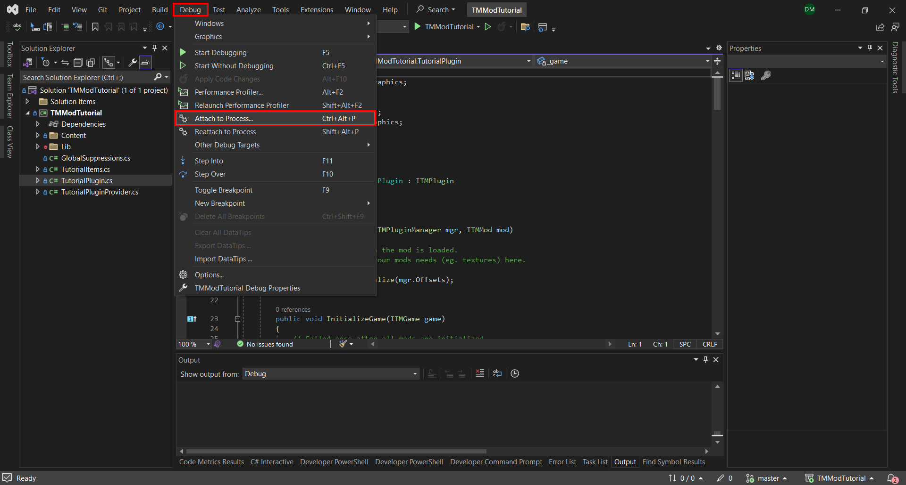
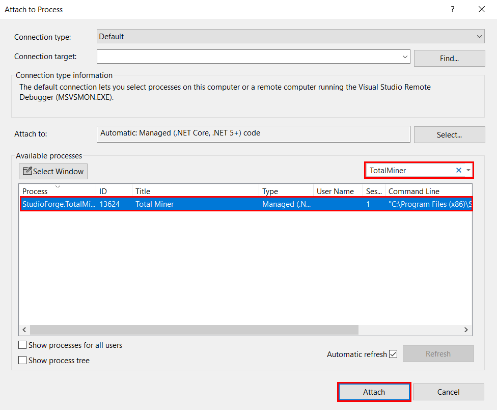

# Creating a Total Miner Mod

This guide is up to date as of Total Miner version `public v2.10.8.1687 5/30/2024`. Some steps may change in the future, but the process should generally be mostly the same.

This guide assumes you have some basic knowledge of C#. If not, you'll need to learn C# first. There are many free resources online to help you get started. If you have any questions regarding Total Miner mod development in particular, feel free to post your question in [#modding](https://discord.com/channels/259780503115137028/1082192148557987900) in the [Total Miner Discord Server](https://discord.gg/TotalMiner)!

This guide is also going to focus on the C# side of mods. Some basic XML setup will be included, but for the most part this guide assumes you either already know how XML mods work (where it's needed) or aren't planning to use it.

We will be using Visual Studio 2022 in this guide, but the setup for Visual Studio 2019 is mostly the same. If you have a different preferred editor, some parts of this guide may not apply the same way.

## Setting up The IDE and MonoGame

If you don't have an IDE already, download [Visual Studio 2022](https://visualstudio.microsoft.com/). The free version (Community Edition) is more than enough for mod development.

**NOTE:** Visual Studio and Visual Studio Code are not the same thing. Visual Studio Code is a general code editor. For mod development, we want Visual Studio, which is a full IDE (integrated development environment).

Next, you'll need the MonoGame project templates to create your project. You can read how to install those [here](https://docs.monogame.net/articles/getting_started/1_setting_up_your_development_environment_windows.html#install-monogame-extension-for-visual-studio-2022)

## Creating the Mod Project

1. Start Visual Studio and select "Create New Project." On the right side of the window, you'll see several templates. If the MonoGame templates are installed, you should see the MonoGame project templates here. Select "MonoGame Game Library"

    

2. Change your project's target framework version to ".NET 7.0." By default, the MonoGame template we used uses .NET 6.0, but Total Miner uses .NET 7.0, so we need to change it. Right-click your project -> "Properties," and select ".NET 7.0" in the "Target Framework" dropdown.

    

3. Now you'll need the Total Miner references so you can use types from Total Miner. Create a new folder in your project to put these references in. In Steam, right-click Total Miner, select "Manage" -> "Browse Local Files."

    

    **NOTE:** You do **not** need to be in the beta for this guide to work. If any guides require the beta version, they will state so.

4. In the game folder, you'll find several `.dll` files. Copy the files listed below to the folder you created in your project. Some files will also have an associated XML file, copy that too. It contains documentation.
    - `StudioForge.TotalMiner.API.dll`: The primary Total Miner API.
    - `StudioForge.BlockWorld.dll`: Types relating to the voxel/block engine the game uses.
    - `StudioForge.Engine.Core.dll`: The core engine types.
    - `StudioForge.Engine.Game.dll`: Types related to the game state.
    - `StudioForge.Engine.GamerServices.dll`: `Gamer` and `GamerID` types, required for some method calls.
    - `StudioForge.Engine.GUI.dll`: Types relating to GUI screens. Allows mods to implement new menus.
    - `StudioForge.Engine.Integration.dll`: Several interfaces, `SpriteBatchSafe`, and `CoreGlobals`, which contains many useful static globals.
    - `StudioForge.Engine.Services.dll`: Miscellaneous `Services` helpers, such as `ElapsedTime` (DeltaTime).

5. Next, add these as references to your project. In Visual Studio, right-click "Dependencies" -> "Add Project Reference..." -> "Browse." Then, select the files you copied into your folder and click "OK." Make sure you're adding them from the folder in your project, not the game's local files.

    

Now that everything's set up, we can create our mod.

## Creating a Basic Plugin (C# Mod)

Your project will contain a "Game1" file. You won't need this, so you can delete it. You'll also have a "Content" folder. Only mods that want to add custom MonoGame content will need this. I recommend keeping it just in case.

### How do Total Miner plugins work?

Total Miner loads plugins by finding an implementation of the `ITMPluginProvider` interface. This will supply the plugin interface implementations to the game. Create a new class and implement this interface. I would recommend naming it `{ModName}PluginProvider`, but you can name it whatever you want.

*Don't forget to add `using StudioForge.TotalMiner.API` at the top of the file to use the interface!*

```csharp
using StudioForge.TotalMiner.API;

namespace TMModTutorial
{
    public sealed class TutorialPluginProvider : ITMPluginProvider
    {
        public ITMPlugin GetPlugin() => null;
        public ITMPluginArcade GetPluginArcade() => null;
        public ITMPluginBlocks GetPluginBlocks() => null;
        public ITMPluginGUI GetPluginGUI() => null;
        public ITMPluginNet GetPluginNet() => null;
        public ITMPluginBiome GetPluginBiome() => null;
        public ITMPluginConfig GetPluginConfig() => null;
    }
}
```

This class will return one or more interface implementations. For any interfaces you aren't implementing, return `null`.

**Note:** This class may be public or internal, sealed or unsealed. These modifiers don't matter here.

The following interfaces can be returned:
- `ITMPlugin`: Basic plugin functionality, such as running code on each game update.
- `ITMPluginArcade`: Used to add custom arcade machine games.
- `ITMPluginBlocks`: Used to build custom meshes and add new menus for blocks, along with changing some other block properties, such as their hitbox.
- `ITMPluginGUI`: Used to add custom setup menus to blocks and items.
- `ITMPluginNet`: Used to add custom networks for multiplayer. This won't be covered here.
- `ITMPluginBiome`: Currently unused.
- `ITMPluginConfig`: Currently unused.

This guide will cover `ITMPlugin`, `ITMPluginArcade`, `ITMPluginBlocks`, and `ITMPluginGUI`. This GitHub repository will also contain the examples shown here.

## ITMPlugin

Your `ITMPlugin` implementation will be used for basic functionality, such as running code on every game update, handling user input, drawing textures/geometry, and adding new Lua functions (shown later).

```csharp
using Microsoft.Xna.Framework.Graphics;
using StudioForge.BlockWorld;
using StudioForge.TotalMiner.API;
using System;

namespace TMModTutorial
{
    public sealed class TutorialPlugin : ITMPlugin
    {
        public void Initialize(ITMPluginManager mgr, ITMMod mod)
        {
            // Called once, when the mod is loaded.
            // Load any assets your mods needs (eg. textures) here.
        }

        public void InitializeGame(ITMGame game)
        {
            // Called once after all mods are initialized.
            // Add events to the game here (eg. item swing events)
            // and set a game field to use later.
        }

        public void UnloadMod()
        {
            // Called when the mod is unloaded.
            // Unload/dispose any assets/resources here.
        }

        public object[] RegisterLuaFunctions(ITMScriptInstance si)
        {
            // Called when registering Lua functions to a script instance.
            // Return an array containing an instance of your Lua functions
            // class or an empty array (if you don't add any Lua functions) here.
            return Array.Empty<object>();
        }

        public void PlayerJoined(ITMPlayer player)
        {
            // Called when a player joins the game.
        }

        public void PlayerLeft(ITMPlayer player)
        {
            // Called when a player leaves the game.
        }

        public void WorldSaved(int version)
        {
            // Called when the world is saved.
            // Use ITMGame.World.WorldPath to get the world path if you
            // want to save files.
        }

        public void Callback(string data, GlobalPoint3D? p, ITMActor actor, ITMActor contextActor)
        {
            // A game-to-mod callback. Implement this to do something for the
            // ModCall script.
        }

        public void Draw(ITMPlayer player, ITMPlayer virtualPlayer, Viewport vp)
        {
            // Called every rendered frame.
            // Draw custom UI or geometry here.
        }

        public bool HandleInput(ITMPlayer player)
        {
            // Called every frame.
            // React to user input here.
            // This method should return true if it does something in response
            // to user input, otherwise false.
            return false;
        }

        public void Update()
        {
            // Called every frame.
            // Implement any player-independent logic that needs to run every
            // frame here.
        }

        public void Update(ITMPlayer player)
        {
            // Called for each player every frame.
            // Implement any player-dependent logic that needs to run every
            // frame here.
        }
    }
}
```

This interface has several methods we can implement:
- `Callback`: A game-to-mod callback. Implement this to do something for the `ModCall` script.
- `Initialize`: Called once, when the mod is loaded. Load any assets your mods needs (eg. textures) here.
- `InitializeGame`: Called once after all mods are initialized. Add events to the game here (eg. item swing events) and set a game field to use later.
- `Unload`: Called when the mod is unloaded. Unload/dispose any assets/resources here.
- `RegisterLuaFunctions`: Called when registering Lua functions to a script instance. Return an array containing an instance of your Lua functions class or an empty array (if you don't add any Lua functions) here.
- `PlayerJoined`: Called when a player joins the game.
- `PlayerLeft`: Called when a player leaves the game.
- `WorldSaved`: Called when the world is saved. Use `ITMGame.World.WorldPath` to get the world path if you want to save files.
- `Draw`: Called every rendered frame. Draw custom UI or geometry here.
    - Drawing custom geometry is out of the scope of this guide, just know that drawing custom geometry in Total Miner is the same as any other MonoGame project, but you'll likely have to write any effects/shaders yourself.
- `HandleInput`: Called every frame. React to user input here. This method should return true if it does something in response to user input, otherwise false.
- `Update()`: Called every frame. Implement any player-independent logic that needs to run every frame here.
- `Update(ITMPlayer)`: Called for each player every frame. Implement any player-dependent logic that needs to run every frame here.

**NOTE:** From this point forward, the code blocks shown will not contain the entire file, and will likely result in a compiler error if copy/pasted.

Make sure to return a new instance of this plugin in your plugin provider's `GetPlugin` implementation, otherwise your mod won't do anything!

```csharp
public sealed class TutorialPluginProvider : ITMPluginProvider
{
    public ITMPlugin GetPlugin() => new TutorialPlugin();
}
```

To make sure we set everything up properly, we'll display a notification in the `Update` method. First, we'll have to keep a field for the main `ITMGame` object so we can call methods on it. We can set this field in `InitializeGame`:

```csharp
public sealed class TutorialPlugin : ITMPlugin
{
    private ITMGame _game;

    public void InitializeGame(ITMGame game)
    {
        _game = game;
    }
}
```

Now, we can call `ITMGame.AddNotification` in `Update`:

```csharp
public sealed class TutorialPlugin : ITMPlugin
{
    private ITMGame _game;

    public void Update()
    {
        _game.AddNotification("It's working!");
    }
}
```

**NOTE:** If this method call is producing a warning about the call site being reachable on all platforms, you can supress it by hovering over it, then clicking "Show Potential Fixes" or pressing `Alt + Enter` -> "Suppress or configure issues" -> "Suppress CA1416" -> "In Suppression File." This will add a new file to the project named `GlobalSuppressions.cs`, which will hide the warning.


Open the file it creates, and change the scope from `Scope = "member"` to `Scope = "module"`, and delete `Target = "*"` to suppress the warning for the entire project.

Now, we can build our mod. Click "Build" -> "Build Solution." Alternatively, you can press `Ctrl + Shift + B` to start the build. Once it's finished, the output window should show "1 succeeded." If it shows an error, make sure everything is set up correctly. Some common errors include:
- The mod references the `StudioForge.TotalMiner.dll` file instead of `StudioForge.TotalMiner.API.dll`. Make sure the file with `API` in the name is included.
- The project has an incorrect framework version (see [Creating The Mod Project](#creating-the-mod-project) step 2.)

If it's not one of those, make sure there are no errors in your code.


**NOTE:** There may be some build warnings about the build configuration. If there are, you can remove them by change the target architecture to x64 using the Configuration Manager, as that's what Total Miner targets. Doing so will change the output directory from `bin/Debug/net7-0` to `bin/x64/Debug/net7-0`

Open the build output folder. Right-click the project -> "Open Folder in File Explorer," and go to `bin/Debug/net7.0` to find your built project. In this folder should be a file with the named `{ProjectName}.dll`. Copy that to your mod folder.

**NOTE:** The references you added previously will be here as well. **Do not** copy those, only copy your main mod DLL file.

### Create a Mod Folder

If you already have a folder for your mod, you can skip this section.

If you don't already have a folder for your mod, go to your Total Miner's save folder (by default, `Documents/My Games/TotalMiner`), and open `Mods`. Create a new folder here with the name of your mod.

Next, add a `ModInfo.xml` file to that folder. This will contain information about the mod to display on the menu.

```xml
<ModInfoXML>
  <ID>TotalBob.TMModTutorial</ID>
  <Name>TM Mod Tutorial</Name>
  <Desc>A basic Total Miner mod example.</Desc>
  <Author>Total Bob</Author>
  <Website>https://github.com/TotalBob/TMModTutorial</Website>
  <Version>
    <Major>1</Major>
    <Minor>0</Minor>
    <Patch>0</Patch>
  </Version>
</ModInfoXML>
```

This file contains the following information:
- `ID`: The ID of your mod. It is recommended for this to be `{UserName}.{ModName}`. Once you release your mod publicly, this shouldn't change.
- `Name`: The display name of your mod. This is what's shown in the menu.
- `Desc`: The description of your mod. This is shown in the menu.
- `Author`: The author of the mod. You can use your username here. You shouldn't use your real name unless you're comfortable with that being public.
- `Website`: The website for your mod. This will usually be the mod's GitHub repository (if it has one).
- `Version`: The version of the mod. It is recommended to follow [Semantic Versioning](https://semver.org/) for consistency.

Now you can copy your DLL to this folder. Make sure it's in the root of your mod folder, as it won't be loaded otherwise. Your mod should look like this:

```
Mod Folder
| - ModInfo.xml
| - {ProjectName}.dll
```

### Enabling The Mod

Start Total Miner, and create a new world. In the mod menu, you should see your newly created mod. Simply click it to enable it, then load the world.


Once you load into the world, you should see that notification we added before. That means the mod is working, and you can start implementing more advanced functionality!


If the mod isn't loading or isn't working, you may have made an error somewhere. Some common errors at this stage include:
- Not implementing `ITMPluginProvider`.
- Not returning your `ITMPlugin` implementation.
- Not setting your `game` field in `InitializeGame`.

## Attaching the Visual Studio Debugger

When developing mods, sometimes you'll run into unexpected issues. Occasionally, these can be extremely difficult to identify without proper debugging tools. This section will explain how to attach the Visual Studio debugger to Total Miner, so you can use breakpoints and `Debug` methods while developing your mod.

In Visual Studio, while Total Miner is running, click "Debug" -> "Attach To Process."



This will open another window. Here, you can select a process to attach the debugger to. Search for "TotalMiner," select it, and click "Attach"



Now, you can use Visual Studio's debugging features to debug your mod. Keep in mind that you'll have to stop debugging to rebuild the mod. When you want to reattach the debugger, you can click "Debug" -> "Reattach To Process" instead, or press `Shift + Alt + P`.

## Adding More Features

Now we have a basic C# mod loaded and working in-game. From here, you can add any functionality you like. More guides for Total Miner-specific features will be added overtime.

Below is the full code of the mod at this stage:

`TutorialPluginProvider.cs`:

```csharp
using StudioForge.TotalMiner.API;

namespace TMModTutorial
{
    public sealed class TutorialPluginProvider : ITMPluginProvider
    {
        // Basic plugin functionality, such as running code on each game update.
        public ITMPlugin GetPlugin() => new TutorialPlugin();

        // Used to add custom arcade machine games.
        public ITMPluginArcade GetPluginArcade() => null;

        // Used to build custom meshes and add new menus for blocks, along with changing some other block properties, such as their hitbox.
        public ITMPluginBlocks GetPluginBlocks() => null;

        // Used to add custom setup menus to blocks and items.
        public ITMPluginGUI GetPluginGUI() => null;

        // Used to add custom networks for multiplayer. This won't be covered here.
        public ITMPluginNet GetPluginNet() => null;

        // Currently unused.
        public ITMPluginBiome GetPluginBiome() => null;

        // Currently unused.
        public ITMPluginConfig GetPluginConfig() => null;
    }
}
```

`TutorialPlugin.cs`:

```csharp
using Microsoft.Xna.Framework.Graphics;
using StudioForge.BlockWorld;
using StudioForge.TotalMiner.API;
using System;

namespace TMModTutorial
{
    public sealed class TutorialPlugin : ITMPlugin
    {
        private ITMGame _game;

        public void Initialize(ITMPluginManager mgr, ITMMod mod)
        {
            // Called once, when the mod is loaded.
            // Load any assets your mods needs (eg. textures) here.
        }

        public void InitializeGame(ITMGame game)
        {
            // Called once after all mods are initialized.
            // Add events to the game here (eg. item swing events)
            // and set a game field to use later.
            _game = game;
        }

        public void UnloadMod()
        {
            // Called when the mod is unloaded.
            // Unload/dispose any assets/resources here.
        }

        public object[] RegisterLuaFunctions(ITMScriptInstance si)
        {
            // Called when registering Lua functions to a script instance.
            // Return an array containing an instance of your Lua functions
            // class or an empty array (if you don't add any Lua functions) here.
            return Array.Empty<object>();
        }

        public void PlayerJoined(ITMPlayer player)
        {
            // Called when a player joins the game.
        }

        public void PlayerLeft(ITMPlayer player)
        {
            // Called when a player leaves the game.
        }

        public void WorldSaved(int version)
        {
            // Called when the world is saved.
            // Use ITMGame.World.WorldPath to get the world path if you
            // want to save files.
        }

        public void Callback(string data, GlobalPoint3D? p, ITMActor actor, ITMActor contextActor)
        {
            // A game-to-mod callback. Implement this to do something for the
            // ModCall script.
        }

        public void Draw(ITMPlayer player, ITMPlayer virtualPlayer, Viewport vp)
        {
            // Called every rendered frame.
            // Draw custom UI or geometry here.
        }

        public bool HandleInput(ITMPlayer player)
        {
            // Called every frame.
            // React to user input here.
            // This method should return true if it does something in response
            // to user input, otherwise false.
            return false;
        }

        public void Update()
        {
            // Called every frame.
            // Implement any player-independent logic that needs to run every
            // frame here.
            _game.AddNotification("It's working!");
        }

        public void Update(ITMPlayer player)
        {
            // Called for each player every frame.
            // Implement any player-dependent logic that needs to run every
            // frame here.
        }
    }
}
```

Here are some topics you can look into next. Of course, not all mods will need to use all of these featues, so feel free to look into anything your specific mod needs.

## [Custom Items](./CustomItems.md)

Access your XML-defined items with C# and add events that will be executed when the item is swung.

## [Handling Input](./HandlingInput.md)

Perform actions when the player presses a key or button.

## [Saving Data](./SavingData.md)

Save custom data for the world that shouldn't reset when the world is reloaded.